# Leopard Research

*Research and Software Services*

# Quadruped Chassis Construction

Now we are going to build this quadruped chassis. Afterwards, we can add a body to make a robotic animal.

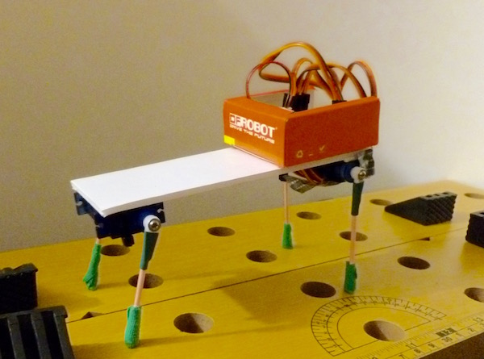

With four independent legs, this robot can walk better. Because it requires 4 servos, you need to team up with your partner to have enough servos. Let's get started!

## Section 1: Assemble the Servos

Note: We need to build 2 servo assemblies (4 servos total). Each person can assemble 1. Afterwards, you need to combine your efforts to build 1 robot.

1. Place the servos like this. The orientation of the white pieces matters.

   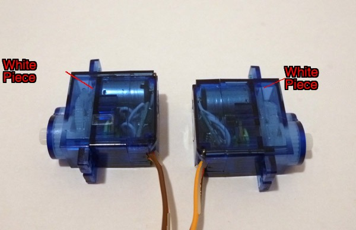

2. Use double-sided tape — the weakest kind — to join them:

   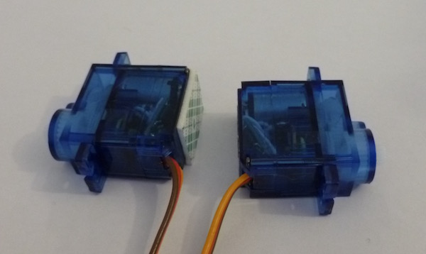

   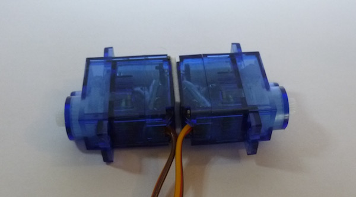

3. There is no step 3

4. There is no step 4

## Section 2: Assemble the Platform

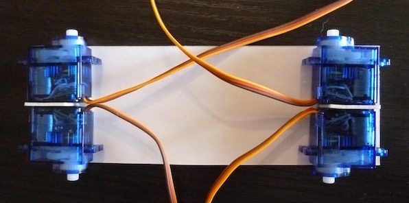

5. Now switch tape — use stronger double-sided tape. Maintain the orientation of the white pieces on the servos. Attach a piece of tape to the servos:

   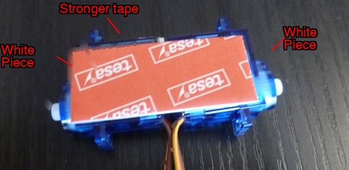

6. Stick it onto the foam board. Watch the orientation of the white pieces — the tape sticks very well, so orient it correctly the first time!

   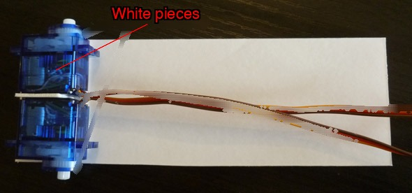

7. Now the second one. Carefully note the orientation — it is symmetrical around the center:

   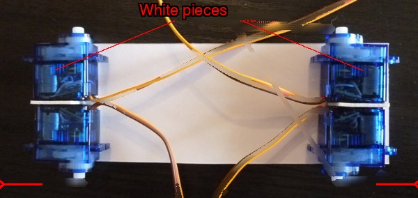

8. Flatten the cables and use tape to secure them to the board, to improve cable management:

   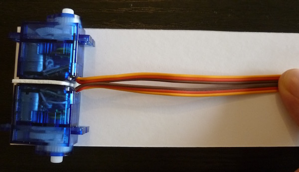
   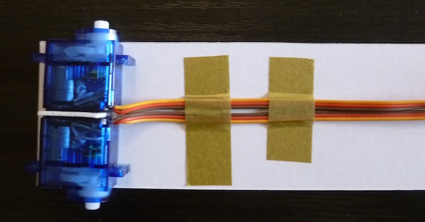

## Section 3: Assemble the Legs

9. There are 2 different types of legs. The rear legs are the longer ones.

   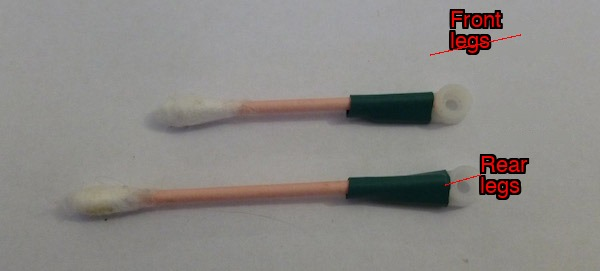

10. Use kinesiology tape to form the feet (for all 4):

    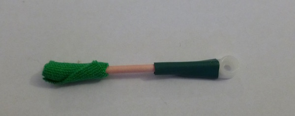

11. Attach the legs to the robot. You don't need to use screws at this point — we will adjust the legs later. The front legs are lower, so the robot tilts forward. This will help it walk.

    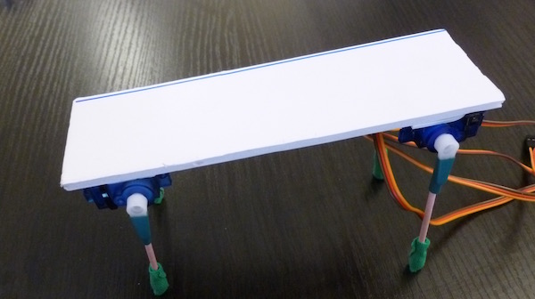

12. Cut the small box with scissors to form a cargo box. Attach it to the board, above the rear legs, with a piece of double-sided tape (the weak kind) underneath the box:

    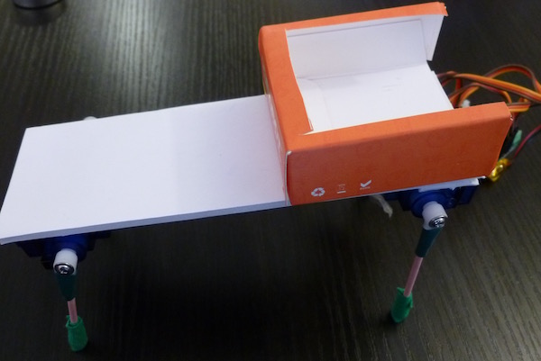

## Section 4: Assemble the Cables

13. Start with the shield with the battery already attached using weak double-sided tape, like on the insect-bot:

    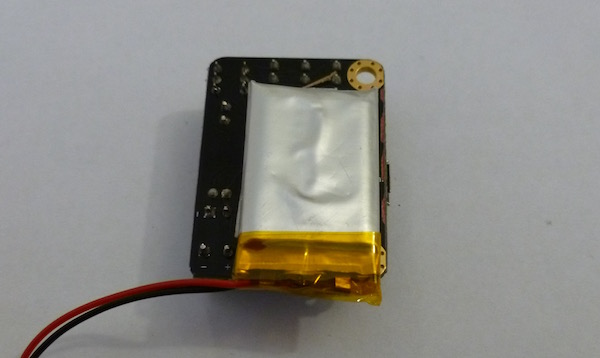

14. To connect the cables, we use a numbering system for the servos, like this (in this photo, the robot is upside down):

    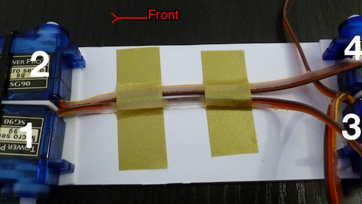

15. Follow the cable from servo number 1. Connect it like this:

    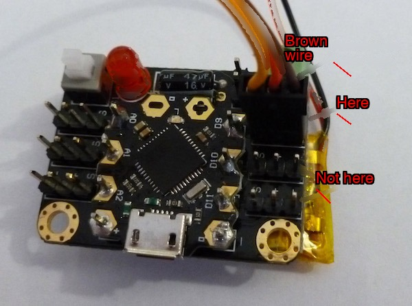

16. Continue with the cable from servo number 2:

    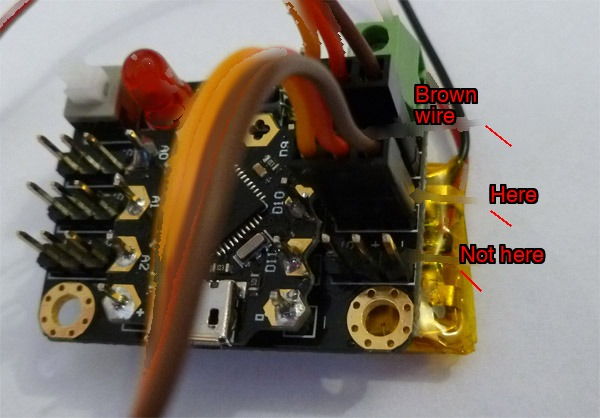

17. And with the cable from servo number 3:

    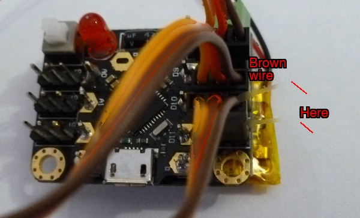

18. Finally, servo number 4. Note the orientation of the brown wire, away from the chip:

    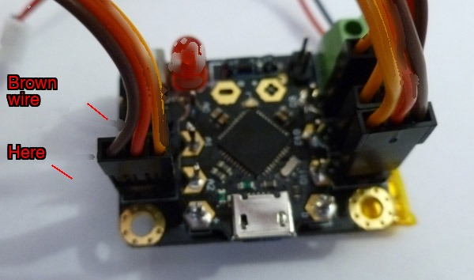

19. And connect the battery cable, like this. Pliers may help:

    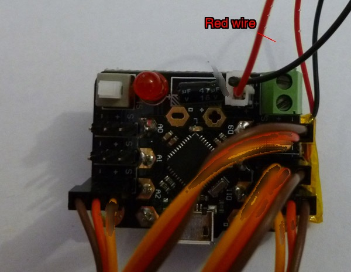

20. It's ready! Place the shield in the cargo box (loosely), and we can proceed to programming to verify the cables and adjust the legs.

    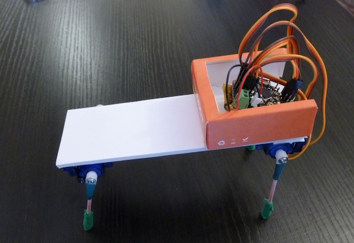

## Section 5: Testing and Adjustment

21. Go to the programming station to load a program to center the servos and test each leg. The program moves each leg the number of times corresponding to its number (once for servo 1, twice for servo 2, etc.). If they are wrong, you can swap the cables. Refer to the diagram in step 14.

22. With the servos centered, adjust the legs (remove and replace them). The rear legs should be in an almost vertical position when the servos are centered. For the front legs, place them at a greater angle so that the front of the robot is lower (this helps it walk).

    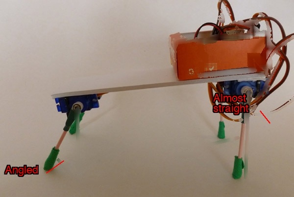
 